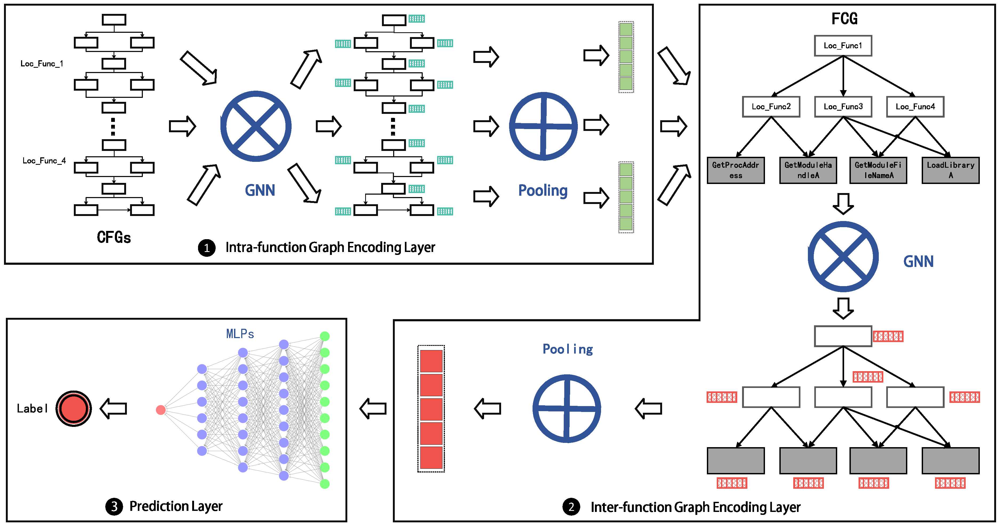

# MalGraph: Hierarchical Graph Neural Networks for Robust Windows Malware Detection


## 1. Description

In this paper, we propose [**MalGraph**](https://www.github.com), a hierarchical graph  neural network to build an effective and robust Windows PE  malware detection. In particular, MalGraph makes better use  of the hierarchical graph representation which incorporates  the inter-function call graph with intra-function control flow  graphs for representing the executable program.
If you find this paper or this repo is useful for you, we would like to have you cite our paper as follows.



Xiang Ling, Lingfei Wu, Wei Deng, Sheng Zhang, Zhenqing Qu, Jiangyu Zhang, Tengfei Ma, Bin Wang, Chunming Wu and Shouling Ji, MalGraph: Hierarchical Graph Neural Networks for Robust Windows Malware Detection, IEEE International Conference on Computer Communications (**INFOCOM**) 2022.

 ``` 
@inproceedings{ling2022malgraph,
  title={{MalGraph}: Hierarchical Graph Neural Networks for Robust Windows Malware Detection},
  author={Ling, Xiang and Wu, Lingfei and Deng, Wei and Qu, Zhenqing and Zhang, Jiangyu and Zhang, Sheng and Ma, Tengfei and Wang, Bin and Wu, Chunming and Ji, Shouling},
  booktitle={IEEE Conference on Computer Communications (INFOCOM)},
  pages={},
  year={2022},
  address={Virtual Event},
  publisher={IEEE}
}
 ```

## 2. Usage

It is necessary to use IDA Pro and the function of `parse_json_list_2_pyg_object()` in `./samples/Preprocess.py` to generate the hierarchical graph representation with `torch_geometric.data.Data` for all file in the training/validation/testing set.
One illustrating example can be found in the folder of `samples/README.md`
In addition, we also provide the ``src/utils/Vocabulary.py`` which is the core implementation for us to build and save the vocabulary of external function names for all files in the training set.

After preparing both the preprocess_dataset and train_vocab_file, we can train our model of MalGraph.
It is noted that all hyper-parameters are configured in ``configs/default.yaml`` which should be first configured manually.
And then we can directly train our model via ``python DistTrainModel.py``