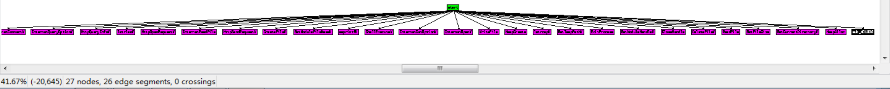
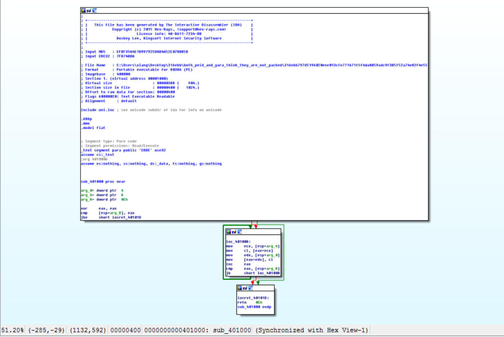
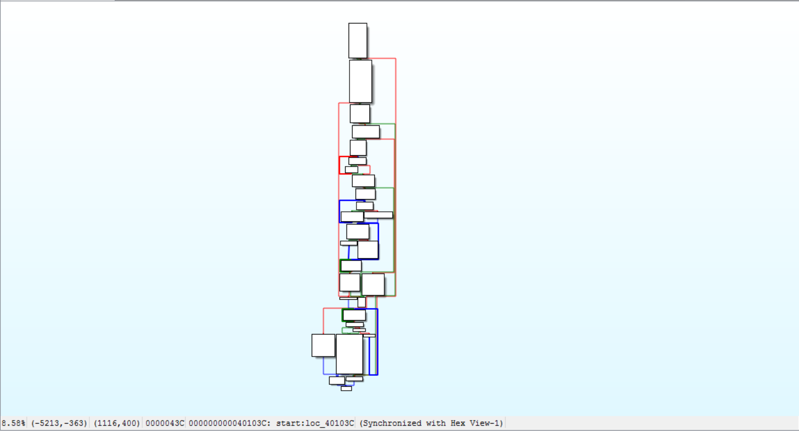

# Data Preprocessing 

### STEP 1: PE Disassemble

We first use IDA Pro 6.4 to disassemble one given portable executable (PE) file, obtaining one function call graph (i.e., FCG, including both external functions and local functions) and corresponding control flow graphs (CFGs) of local functions.
In fact, FCG can be exported as Graph Description Language GDL file format, and CFGs can be processed as ACFGs, which are mainly built on the GitHub repo of https://github.com/qian-feng/Gencoding.
We therefore refer interested readers to this repo for more details.

Taking one PE file as an example, we can use IDA Pro to get the following FCG (25 external functions and 2 local functions)

and two CFGs of local functions, i.e., sub_401000 and 40103C as follows.


After that, we can save the above hierarchical graph representation into sample.jsonl as follows.

```
{"function_edges": [[1, 1, ..., 1], [0, 2, ..., 26]], "acfg_list": [{"block_number": 3, "block_edges": [[0, 0, 1, 1], [0, 2, 0, 2]], "block_features": [[0, 2, ...], [0, 2, ...], [1, 0, ...]]}, {"block_number": 29, "block_edges": [[0, 1, ..., 28], [16, 0, ..., 8]], "block_features": [[8, 2, ...], [0, 7, ...], [0, 7, ...], [0, 7, ...], [0, 7, ...], [0, 7,...], [1, 18, ...], [1, 21, ...], [0, 21,...], [0, 24, ...], [1, 26, ...], [1, 2, ...], [5, 4, ...], [4, 11, ...], [2, 14, ...], [3, 17, ...], [1, 1, ...], [0, 14, ...], [3, 17, ...], [0, 17, ...], [2, 28, ...], [0, 11, ...], [0, 0, ...], [1, 1, ...], [12, 27, ...], [0, 0, ...], [2, 9, ...], [2, 14,...], [1, 21, ...]]}], "function_names": ["sub_401000", "start", "GetTempPathW", "GetFileSize", ... , "InternetOpenW"], "hash": "3***5", "function_number": 27}
```

### STEP 2: Convert the resulting json file to PyG data object
However, the above resulting json object can not be directly inputted into our model, we therefore convert it into a PyTorch_Geometric `data` object and provide one example python script of `PreProcess.py` for interested readers.